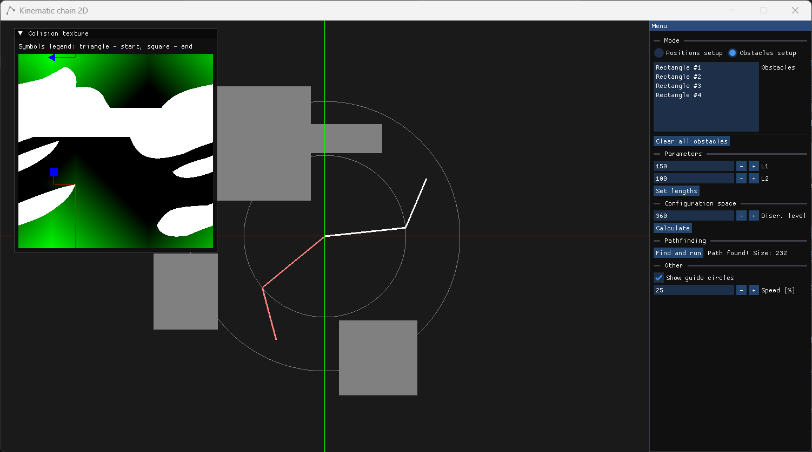

# 2D Kinematic Chain Pathfinding
The program was developed as part of the course 'Programming of Numerically Controlled Equipment'.

Interactive program for pathfinding in a planar 2-joint robotic arm with obstacles. Features include:

- Edit mode to define robot parameters (L1, L2) and obstacles
- Inverse kinematics to reach clicked points (with visual feedback)
- Config space (α1, α2) visualization with obstacle collision detection
- Flood-fill pathfinding between chosen start/end effector positions
- Animated path in workspace and config space with gradient visualization

## Stack
Here is the stack used to develop this piece of software:
### Main:
- C++
- OpenGL (GLSL)
### Dependencies:
- ImGui - UI
- GLFW - windowing
- GLM - math
